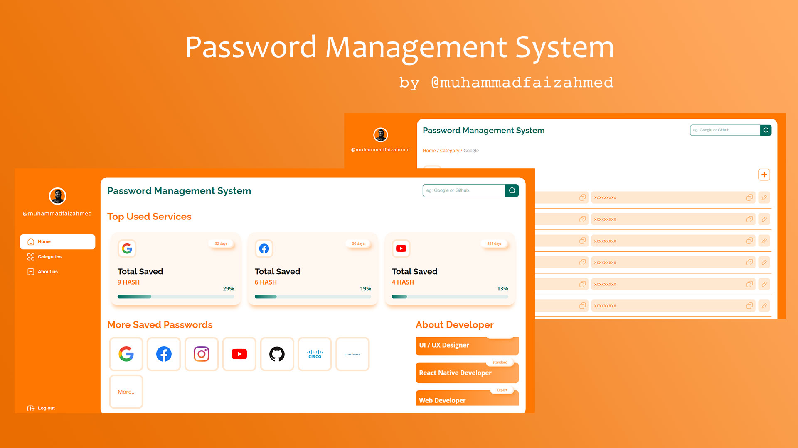

# Password Management System

An UI/UX or Frontend based Webapp for storing passwords on your local storage


## Developed with React JS  
## Sanpshots.


## Technologies.

1. Context Api 
2. Atomic Design Structure
3. Fully Customizable Components
4. SCSS (CSS Pre-Processor)

## Installation

Clone Github's Repo on your local machine.

```
 git clone https://github.com/sheikhfaiz546/PMS-WebApp.git PMS-WebApp 
```
Install all Packages & Dependencies
```
 cd PMS-WebApp 
 
 npm install
```
Run on Local Host [http://localhost:3000](http://localhost:3000)
```
 npm start
```

## Screenshots 

Screen shots goes here

## About Developer

**Muhammad Faiz Ahmed**,\
MERN Stack Developer | UI/UX Designer |
React js Developer | Web Designer & Developer 


Professional in.\
**Frontend**\
1- UI/UX\
1- HTML\
3- CSS latest\
4- Bootstrap\
5- javaScript\
6- ECMA Script 6+\
7- React js\
8- Material UI

**Backend**\
1- Node js\
2- Mongoose\
3- Mongo DB\
4- Rest Apis\
5- Node Package Manager

Many Technologies Needs \
to Learn\
to Cover\
to Implement\
to Experience\
to Convey\
to Teach

*Have a Nice Day\
Happy Coding* 😊